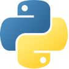
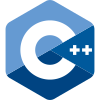
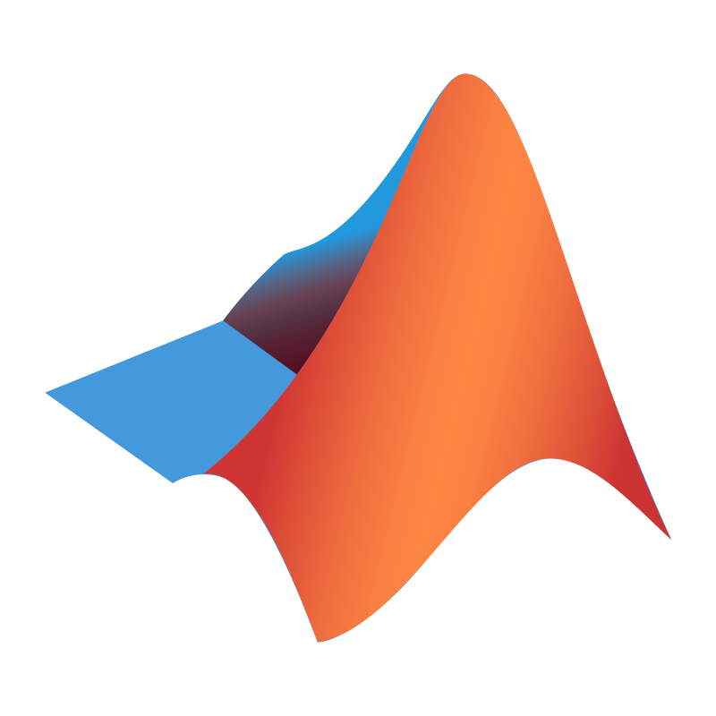
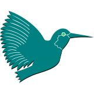
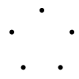
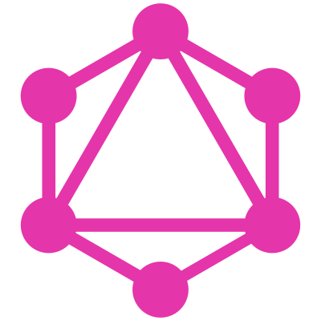

# Hey there! 👋
I'm Max! But also, I'm a...

- 🎓 **Third year BSc Honors Computing Science student** @ the [University of Alberta](https://www.ualberta.ca)&nbsp;
  
  
  
  
  
  
  
  
 - 🐉 **[NSERC USRA](https://www.nserc-crsng.gc.ca/students-etudiants/ug-pc/usra-brpc_eng.asp) Scholar** @ the [Compiler Design and Optimization Lab](https://webdocs.cs.ualberta.ca/~amaral/)&nbsp;
   
   
   
   
   

Formerly:

- 🌐 **Web Developer** @ [Endeavor Technologies](https://www.endeavortech.com/)&nbsp;
  
  
  
  
  
  
  
- 📝 **Software Tester** @ [GMCL](https://gmcl.com/)&nbsp;
  
  
  
